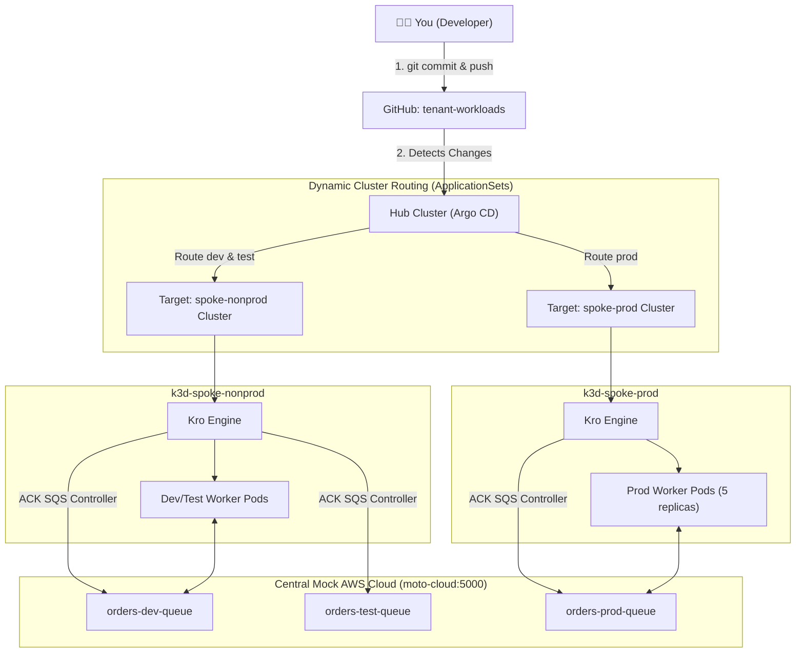

# Developer Tutorial: Building Cloud Apps on the Multi-Cluster Platform

Welcome! This tutorial guides you through using our enterprise **Multi-Cluster Hub-and-Spoke** platform as an **application developer**.

As a developer, you don't need real AWS cloud accounts, complex IAM policies, or direct Kubernetes cluster-admin access. You define what your application needs in a simple YAML file, push it to GitHub, and the GitOps platform takes care of:
1. **Routing** your workloads to the correct cluster (`spoke-nonprod` for DEV/TEST, `spoke-prod` for PROD).
2. **Provisioning** your Kubernetes pods and containers.
3. **Provisioning** simulated AWS infrastructure (like SQS Queues) in our central mock cloud (Moto).
4. **Wiring** the cloud resources directly into your containers via environment variables.

---

## 💡 How It Works Under the Hood



---

## 📁 Repository Structure

Your code lives in [`tenant-workloads`](https://github.com/brunobml/tenant-workloads):

```text
tenants/
└── tenant-a/
    ├── dev/                # Deployed to spoke-nonprod (namespace: tenant-a-dev)
    │   └── orders-service.yaml
    ├── test/               # Deployed to spoke-nonprod (namespace: tenant-a-test)
    │   └── orders-service.yaml
    └── prod/               # Deployed to spoke-prod (namespace: tenant-a-prod)
        └── orders-service.yaml
```

The GitOps platform uses folder names to make decisions:
- `tenants/<tenant-name>/dev` $\rightarrow$ automatically routes to **`spoke-nonprod`** in namespace `<tenant-name>-dev`.
- `tenants/<tenant-name>/test` $\rightarrow$ automatically routes to **`spoke-nonprod`** in namespace `<tenant-name>-test`.
- `tenants/<tenant-name>/prod` $\rightarrow$ automatically routes to **`spoke-prod`** in namespace `<tenant-name>-prod`.

---

## 🚀 5-Minute Quickstart

### Step 1: Open Your Dashboards
- **Hub Argo CD UI**: [http://localhost:8080](http://localhost:8080)
  - Username: `admin`
  - Password: Run `kubectl --context k3d-hub-cluster -n argocd get secret argocd-initial-admin-secret -o jsonpath="{.data.password}" | base64 -d`
  - Here you will see all your tenant applications: `tenant-a-dev`, `tenant-a-test`, `tenant-a-prod`.
- **Central Moto Cloud API**: [http://localhost:5000/moto-api/](http://localhost:5000/moto-api/)

---

### Step 2: Understand the Service Manifest

Look at [`tenants/tenant-a/dev/orders-service.yaml`](file:///home/bleite/repos/tenant-workloads/tenants/tenant-a/dev/orders-service.yaml):

```yaml
apiVersion: kro.run/v1alpha1
kind: MessageProcessor
metadata:
  name: orders
spec:
  name: orders
  environment: dev
  replicas: 1
  messageRetentionPeriod: "86400"
```

Notice how minimal this is! You only specify:
- `kind: MessageProcessor`: The high-level blueprint from the platform catalog.
- `environment: dev`: Targets your environment naming.
- `replicas: 1`: Number of worker pods.
- `messageRetentionPeriod: "86400"`: SQS queue retention (in seconds).

Under the hood, **Kro** automatically generates:
1. A Kubernetes `Deployment` (`orders-dev-worker`).
2. An AWS SQS Queue in Central Moto Cloud (`orders-dev-queue`).
3. Passes the `QUEUE_URL` and `QUEUE_ARN` directly to your worker container.

---

### Step 3: Inspecting Your Running Microservice

#### Check the Non-Prod Cluster (Dev & Test):
```bash
# View pods in dev namespace
kubectl --context k3d-spoke-nonprod -n tenant-a-dev get pods

# View pods in test namespace
kubectl --context k3d-spoke-nonprod -n tenant-a-test get pods
```

#### Check the Prod Cluster:
```bash
# View pods in prod namespace (notice 5 replicas!)
kubectl --context k3d-spoke-prod -n tenant-a-prod get pods
```

#### Check Pod Logs (Connecting to AWS SQS):
```bash
kubectl --context k3d-spoke-nonprod -n tenant-a-dev logs -l app=orders-dev-worker --tail=5
```
Output:
```text
Worker started for Queue: http://moto-cloud:5000/123456789012/orders-dev-queue
Worker active and polling from http://moto-cloud:5000/123456789012/orders-dev-queue
```

---

### Step 4: Interacting with Simulated AWS via AWS CLI

From your host machine, you can interact with the mock cloud just like real AWS:

```bash
export AWS_ACCESS_KEY_ID=mock-key
export AWS_SECRET_ACCESS_KEY=mock-secret
export AWS_DEFAULT_REGION=us-east-1

# List all SQS queues across all environments
aws --endpoint-url=http://localhost:5000 sqs list-queues

# Publish a test message to your Dev Queue
aws --endpoint-url=http://localhost:5000 sqs send-message \
  --queue-url "http://localhost:5000/123456789012/orders-dev-queue" \
  --message-body '{"orderId": "ORD-1234", "customer": "Alice", "amount": 99.50}'
```

---

### Step 5: Modifying or Scaling Your Service (GitOps)

Want to scale `tenant-a-dev` from 1 replica to 3 replicas?

1. Edit [`tenants/tenant-a/dev/orders-service.yaml`](file:///home/bleite/repos/tenant-workloads/tenants/tenant-a/dev/orders-service.yaml):
   ```yaml
   spec:
     replicas: 3
   ```

2. Commit and push:
   ```bash
   git add tenants/tenant-a/dev/orders-service.yaml
   git commit -m "scale tenant-a dev workers to 3"
   git push origin main
   ```

3. Argo CD detects the commit on GitHub and automatically scales the deployment in `spoke-nonprod`:
   ```bash
   kubectl --context k3d-spoke-nonprod -n tenant-a-dev get pods
   ```

---

## 📋 Developer Cheat Sheet

| Task | Command |
| :--- | :--- |
| **View Dev Pods** | `kubectl --context k3d-spoke-nonprod -n tenant-a-dev get pods` |
| **View Test Pods** | `kubectl --context k3d-spoke-nonprod -n tenant-a-test get pods` |
| **View Prod Pods** | `kubectl --context k3d-spoke-prod -n tenant-a-prod get pods` |
| **View Worker Logs** | `kubectl --context k3d-spoke-nonprod -n tenant-a-dev logs -l app=orders-dev-worker -f` |
| **List AWS Queues** | `AWS_ACCESS_KEY_ID=mock-key AWS_SECRET_ACCESS_KEY=mock-secret aws --endpoint-url=http://localhost:5000 --region us-east-1 sqs list-queues` |
| **Send Test Message** | `AWS_ACCESS_KEY_ID=mock-key AWS_SECRET_ACCESS_KEY=mock-secret aws --endpoint-url=http://localhost:5000 --region us-east-1 sqs send-message --queue-url <URL> --message-body '{"test": true}'` |
| **Argo CD UI** | [http://localhost:8080](http://localhost:8080) |
| **Moto Cloud API** | [http://localhost:5000/moto-api/](http://localhost:5000/moto-api/) |
